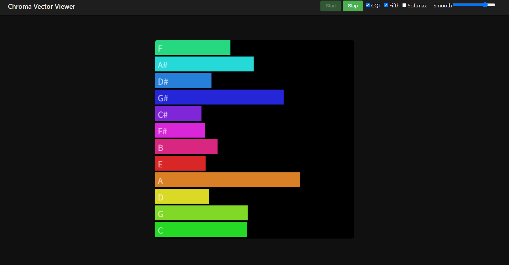

# Chroma Vector Viewer

ブラウザ別ウィンドウ／タブのオーディオをキャプチャし、**クロマベクトル**をリアルタイムに可視化するシンプルな Web アプリです。

楽曲のキー推定やハーモニーの大まかな動きを眺めたいときにどうぞ。

**アクセス🔗**: https://summer498.github.io/chroma-feature/

---

## ✨ 主な機能

| 機能                    | 説明                                                  |
| --------------------- | --------------------------------------------------- |
| **画面（音声）キャプチャ**       | `getDisplayMedia` を利用し、任意のタブ／ウィンドウ／アプリのシステム音を取得します。 |
| **FFT / CQT 切替**      | チェックボックスで CQT（Meyda）クロマに切替可能。軽量な FFT 合算方式との比較ができます。 |
| **Softmax 正規化**       | クロマを確率分布化（総和=1）して相対値を強調。ワンクリックでオン／オフ。               |
| **指数平滑**              | スライダーで滑らかさを 0〜1 で調整。グラフのガタつきを軽減します。                 |
| **五度圏カラー**            | バー色を五度圏順で着色。トニック／ドミナントの関係が直感的。                      |

---

## 使い方

1. **再生中のタブ／アプリ** を用意する（YouTube、Spotify など）。
   - **注意**  Chrome/Edge では音声キャプチャ許可のため **video トラックを含める** 必要があります（コード内で `video:true` を指定済み）。
2. Chroma Vector Viewer を開き **Start** をクリック。
3. キャプチャ対象ウィンドウ／タブを選択し **共有**。
4. 12 本のバーがリアルタイムで動きます。
   - **長さ** … 各ピッチクラスの相対エネルギー
   - **色** … 五度圏順（C→G→D…）
5. ヘッダの **CQT / Softmax / Smooth** を切り替えてお好みに調整。
6. **Stop** でキャプチャ終了。

---

## ライセンス

MIT License © 2025 Summer498
